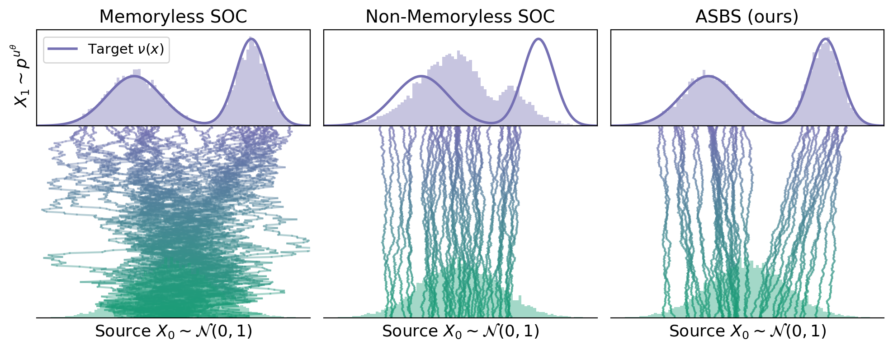

<h1 align='center'>Adjoint-based Diffusion Samplers</h1>

<br>


**Adjoint-based diffusion samplers** is a new class of diffusion models for energy-based Boltzmann distributions that is highly scalable, extremely data-efficient, and achieves strong performance. This repository contains the implementation of adjoint-based diffusion samplers for **synthetic energies**, _e.g._, **Double Well** and **Lennard Jones** potentials. Currently, the repository contains the following adjoint-based diffusion samplers:

- [Adjoint Sampling](https://arxiv.org/abs/2504.11713) (ICML 2025)
- [Adjoint Schrödinger Bridge Sampler](https://arxiv.org/abs/2506.22565) (NeurIPS 2025 Oral)

Note that AS is a special case of ASBS with memoryless condition.
For amortized conformer generation, please check [here](https://github.com/facebookresearch/adjoint_sampling).
For improved ASBS with chemically-sounded exploration (WT-ASBS), please check [here](https://github.com/facebookresearch/wt-asbs).


## Installation

```
uv venv .venv --python 3.11
source .venv/bin/activate

uv pip install torch==2.7.0 --index-url https://download.pytorch.org/whl/cu126
uv pip install torch-scatter -f https://data.pyg.org/whl/torch-2.7.0+cu126.html
uv pip install torch-cluster -f https://data.pyg.org/whl/torch-2.7.0+cu126.html
uv pip install torch-geometric

uv pip install -r requirements.txt # --no-cache 
```

## Run overview

```bash
uv run train.py experiment=dw4_asbs
uv run train.py experiment=dw4_as 
uv run train.py experiment=lj13_asbs 
uv run train.py experiment=lj13_as 
uv run train.py experiment=lj55_asbs 
uv run train.py experiment=lj55_as 
```

## Demo
Run [`scripts/demo.sh`](https://github.com/facebookresearch/adjoint_samplers/blob/main/scripts/demo.sh) to generate similar demo figure in ASBS paper.



## Training DW and LJ energies
Run the following script to download the necessary reference samples to the folder `data` for evaluation purposes:
```
bash scripts/download.sh
```

Training scripts to generate similar results in the papers can be found under
[`scripts`](https://github.com/facebookresearch/adjoint_samplers/blob/main/scripts).
Checkpoints and figures are saved under the folder `results`.
```
python train.py experiment={dw4,lj13,lj55}_{asbs,as} seed=0,1,2 -m
```


## Citation
If you find this repository helpful, please consider citing our paper:
```bibtex
@inproceedings{liu2025asbs,
  title={{Adjoint Schr{\"o}dinger bridge sampler}},
  author={Liu, Guan-Horng and Choi, Jaemoo and Chen, Yongxin and Miller, Benjamin Kurt and Chen, Ricky T. Q.},
  booktitle={Advances in Neural Information Processing Systems (NeurIPS)},
  year={2025},
}
```

## License
This repository is licensed under the [CC BY-NC 4.0 License](https://creativecommons.org/licenses/by-nc/4.0/),
with some portions of the project subject to separate license terms:
[DEM](https://github.com/jarridrb/DEM),
[DDS](https://github.com/franciscovargas/denoising_diffusion_samplers),
and [bgflow](https://github.com/noegroup/bgflow)
are each licensed under the MIT License. Please refer to the respective repositories for details.